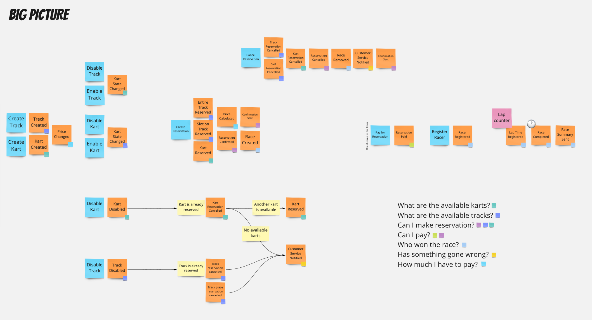
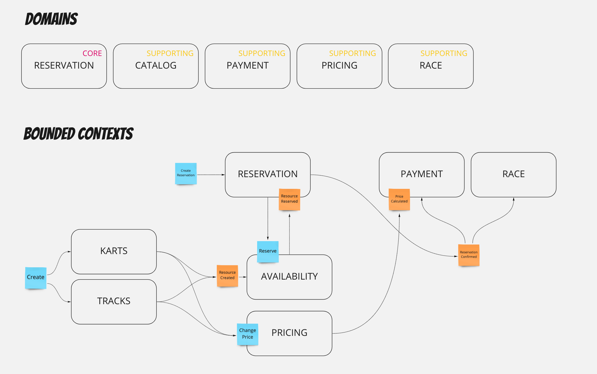
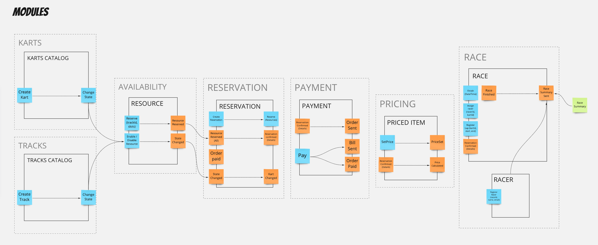
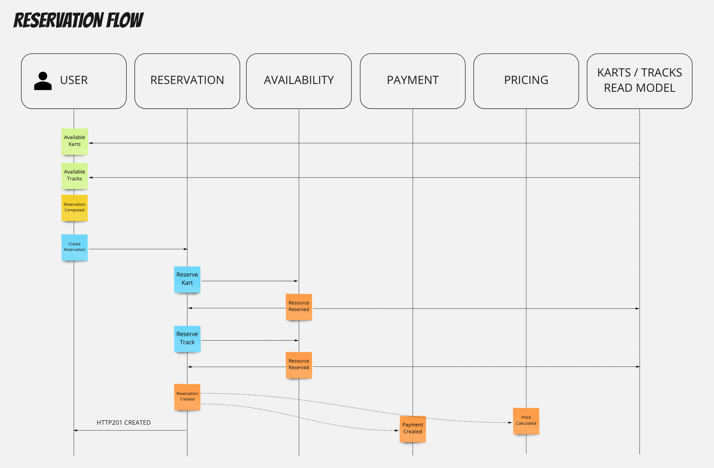

# Karting Event Storming
I'm a beginner in ES, so this is not a referential method.
## Big picture

In the big picture, I had started from chaotic exploration. I had put every domain event (orange) that comes to my mind. Next, I tidy up them chronologically. Next, I'd added the commands (blue), some rules (yellow), and external systems (pink). After those steps, I put some questions on board that describe my app problems. Next, I'd put some small stickers for all events that answer my questions. If there is an event without question, I'm trying to ask questions that this event may answer. If there is a question without an event, I have to try to find events that may answer. Those questions may represent my domains.
## Domains and Contexts

The domains in my case are the 1:1 with questions, asked in Big Picture. I put the simple core flow there.
## Modules

This is simple division to modules. That what is on the screen is very good start for design level event storming. I decided to not do this.
## Reservation Flow

This is the flow of the core domain functionality.
